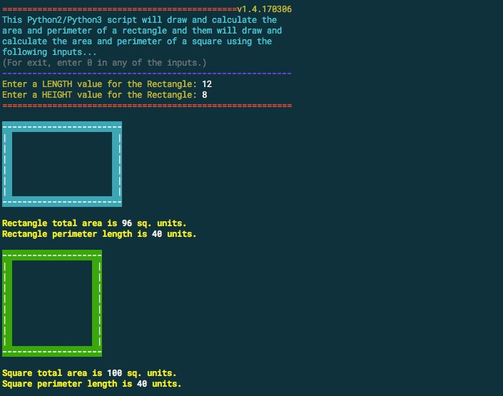

# Square-from-Rectangle

The sqrrec.js (JavaScript) and sqrrec.py (Python 2.x or 3.x) scripts will draw and calculate the area and perimeter of a rectangle base on user input values of Length and Height.  Them, the scripts will draw and calculate the area and perimiter of a square using the input values for the rectangle.

Figure 1: ScreenShot sqrrec.py
